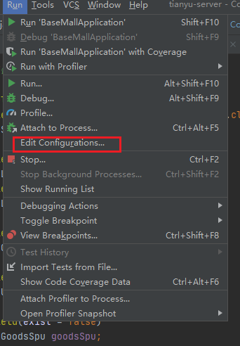
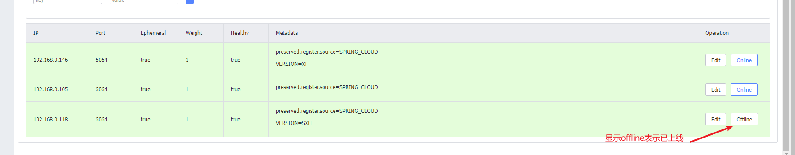

#### 1，Nacos启动准备

一，把conf/nacos-mysql.sql导入数据库，修改conf/applicaiton.properties中的数据库的配置

```properties
### Connect URL of DB:
db.url.0=jdbc:mysql://127.0.0.1:3306/nacos-config?characterEncoding=utf8&connectTimeout=1000&socketTimeout=3000&autoReconnect=true&useUnicode=true&useSSL=false&serverTimezone=UTC
db.user.0=root
db.password.0=333333
```

二，注意检查startup.cmd中的MODE是cluster还是standalone，一般没有集群则改为MODE=standalone

#### 2，Nacos的startup.sh无法在Linux中启动

原因: startup.sh是从windows复制过来的，文件格式是dos，需改为unix

vi  startup.sh : 打开文件

:set  fileformat : 查看文件格式，如果为dos则需修改

:set  fileformat=unix :  修改文件格式

:wq：保存退出

shudown.sh也是同样方法修改

#### 3，Nacos启动报错The server IP list of Nacos is []

原因：启动文件中设置了集群启动模式，而开发环境不具备集群

解决办法一：

./startup.sh  -m  standalone : 启动单体

解决办法二：

修改启动文件startup.sh，把mode=cluster改为 mode=standalone

**注意：Windows环境下同样适用以上两个方法，可编辑startup.cmd文件中的MODE的值**

#### 4，Nacos下载源码启动

 进入到module：nacos-console【由于项目是使用SpringBoot】
 需要进行Run/Debug Configurations
 注意事宜：一定要增加VM options：-Dnacos.standalone=true, 否则启动的是集群模式

2020版idea在这里设置

 


#### ! !，Nacos常见报错解决办法

1）nacos unable to start embedded tomcat

如果日志中，这条错上面有The server IP list of Nacos is []，则按3中的解决。

https://blog.csdn.net/waterseason/article/details/117571539

2)  java.sql.SQLNonTransientConnectionException: Could not create connection to database server

解决办法：

 查看nacos配置文件，在数据库连接配置url上增加allowPublicKeyRetrieval=true配置 

```properties
 db.url.0=jdbc:mysql://192.168.214.128:3306/nacos...&allowPublicKeyRetrieval=true&...
```

3) 服务无法访问
检查服务是否默认下线了。

