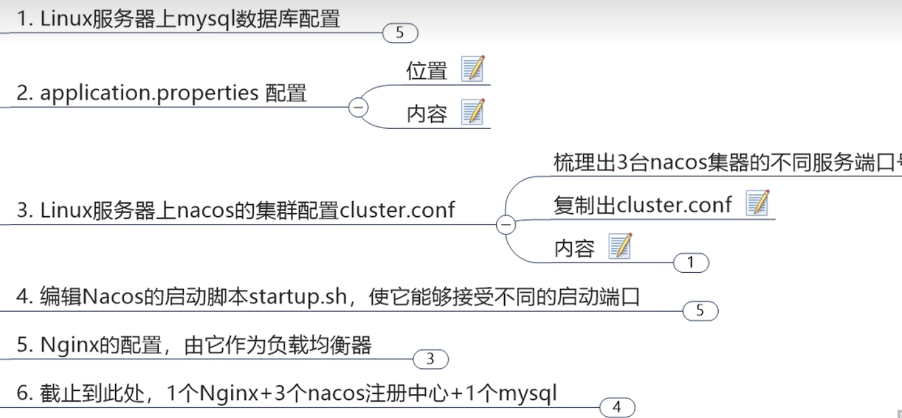
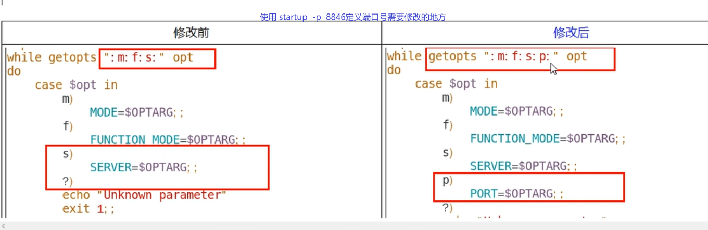
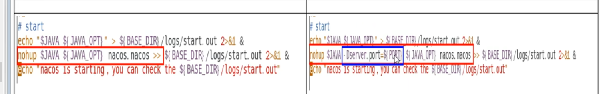
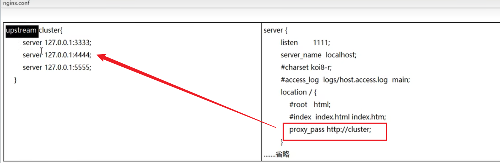

### 1，NACOS概述

Nacos是什么？

Naming  Configuration Service的缩写；

就是注册中心加配置中心的组合。Nacos = Eureka + Config + Bus

### 2，各注册的区别

  CAP即：

- Consistency（一致性）
- Availability（可用性）
- Partition tolerance（分区容忍性）


Nacos同时支持CP和AP，即支持两种模式的切换。


### 3，Nacos命名空间Namespace, Group, DataID概述


1）默认的命名空间是public

2）用途：Namespace,Group,Data ID类似于java中的包名，Nacos用来区分多功能的多集群中使用不同的配置文件，例如，有的要用dev，有的要用test等等。

3）微服务的子模块，即配置的客户端从Nacos寻找配置文件的步骤是，通过bootstartp.yml里设置好参数，先找Namespace(不写默认是public)，再找Group(不写默认是DEFAULT_GROUP)，最后找Data ID；

例：

```yaml
spring:
  application:
    name: nacos-config-client
  cloud:
    nacos:
      discovery:
        server-addr: localhost:8848 #Nacos服务注册中心地址
      config:
        server-addr: localhost:8848 #Nacos作为配置中心地址
        file-extension: yaml #指定yaml格式的配置,也可以是yml
        group: DEV_GROUP
        namespace: 7d8f0f5a-6a53-4785-9686-dd460158e5d4  #Namespace的唯一ID
```

### 4，Nacos集群配置步骤，Linux版


1）三个或三个以上的Nacos才能构成集群

2）Linux环境下Nacos集群配置步骤：



一，首先下载Linux版的Nacos，并解压到合适位置。例：nacos-server-1.4.4.tar.gz；

二，修改conf/applicaiton.properties配置文件，改为使用MySQL数据库；

三，配置cluster.conf文件，把原来的cluster.conf.example复制一份，改名为cluster.conf，在Linux终端执行hostname  -i 查出本机的host  ip，如果是127.0.0.1不要用，改成别的（后期待研究修改方法）。                         

修改方法：vi   /etc/hosts文件，修改映射地址为Linux的虚拟机地址192.168.30.128，正式环境则改为内网IP，类似于使用Nginx修改模拟域名映射。

 ```properties
#配置范例,配置三个Nacos的端口号
192.168.111.444:8848
192.168.111.444:8847
192.168.111.444:8846
 ```

四，修改startup.sh脚本，修改后执行启动命令

./startup.sh  -p 3333       

./startup.sh  -p 4444;

./startup.sh  -p 5555;  

这样就启动了三个Nacos

ps  -ef | grep nacos  | grep  -V  grep | wc  -l  ：查看Nacos的启动数量，如果为3则正确。





五，配置Nginx负载均衡，conf/nginx.conf文件

配置完成后指定该配置文件启动nginx

nginx  -c  .../conf/nginx.conf  :  不指定默认也是此文件



六，微服务模块注册到集群的地址也要变更，改为Nginx的对外提供的地址

```yaml
cloud:
    nacos:
      discovery:        
        # 换成nginx的1111端口，做集群
        server-addr: 192.168.111.144:1111
```


### 5，Nacos从默认的dearby切换到MySQL数据库

修改conf/application.properties配置

```properties
### 放开原来的注释，使用MySQL数据库:
spring.datasource.platform=mysql
### 设置MySQL参数，把原来的“db.url.0”中的“.0”去掉:
db.url=jdbc:mysql://127.0.0.1:3306/nacos-config?characterEncoding=utf8&connectTimeout=1000&socketTimeout=3000&autoReconnect=true&useUnicode=true&useSSL=false&serverTimezone=UTC
db.user=root
db.password=root
```

