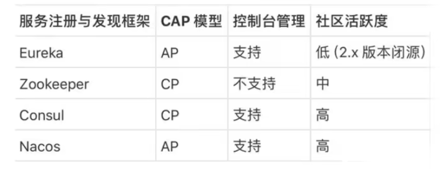
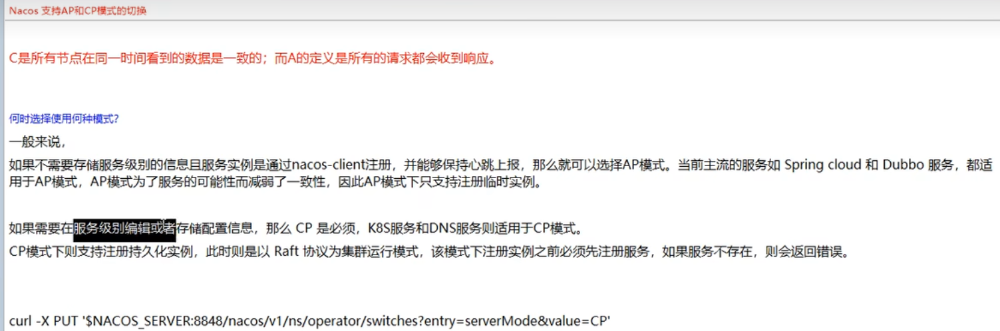
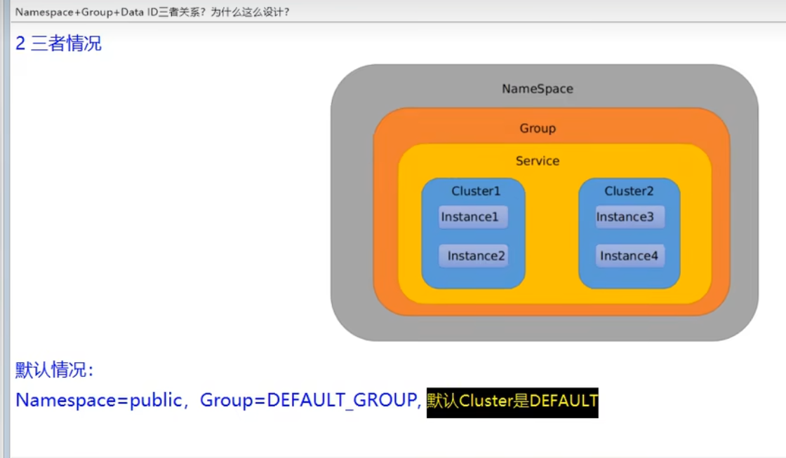
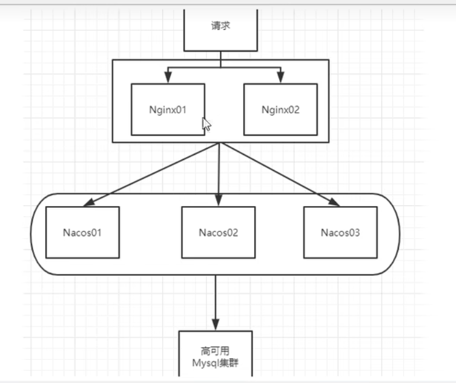

### 1，NACOS概述

Nacos是什么？

Naming  Configuration Service的缩写；

就是注册中心加配置中心的组合。Nacos = Eureka + Config + Bus

### 2，各注册的区别

  CAP即：

- Consistency（一致性）
- Availability（可用性）
- Partition tolerance（分区容忍性）



Nacos同时支持CP和AP，即支持两种模式的切换。



### 3，Nacos命名空间Namespace, Group, DataID概述



1）默认的命名空间是public

2）用途：Namespace,Group,Data ID类似于java中的包名，Nacos用来区分多功能的多集群中使用不同的配置文件，例如，有的要用dev，有的要用test等等。

3）微服务的子模块，即配置的客户端从Nacos寻找配置文件的步骤是，通过bootstartp.yml里设置好参数，先找Namespace(不写默认是public)，再找Group(不写默认是DEFAULT_GROUP)，最后找Data ID；

例：

```yaml
spring:
  application:
    name: nacos-config-client
  cloud:
    nacos:
      discovery:
        server-addr: localhost:8848 #Nacos服务注册中心地址
      config:
        server-addr: localhost:8848 #Nacos作为配置中心地址
        file-extension: yaml #指定yaml格式的配置,也可以是yml
        group: DEV_GROUP
        namespace: 7d8f0f5a-6a53-4785-9686-dd460158e5d4  #Namespace的唯一ID
```

### 4，Nacos集群



