### 1，NACOS概述

Nacos是什么？

Naming  Configuration Service的缩写；

就是注册中心加配置中心的组合。Nacos = Eureka + Config + Bus

### 2，各注册的区别

  CAP即：

- Consistency（一致性）
- Availability（可用性）
- Partition tolerance（分区容忍性）


Nacos同时支持CP和AP，即支持两种模式的切换。


### 3，Nacos命名空间Namespace, Group, DataID概述


1）默认的命名空间是public

2）用途：Namespace,Group,Data ID类似于java中的包名，Nacos用来区分多功能的多集群中使用不同的配置文件，例如，有的要用dev，有的要用test等等。

3）微服务的子模块，即配置的客户端从Nacos寻找配置文件的步骤是，通过bootstartp.yml里设置好参数，先找Namespace(不写默认是public)，再找Group(不写默认是DEFAULT_GROUP)，最后找Data ID；

例：

```yaml
spring:
  application:
    name: nacos-config-client
  cloud:
    nacos:
      discovery:
        server-addr: localhost:8848 #Nacos服务注册中心地址
      config:
        server-addr: localhost:8848 #Nacos作为配置中心地址
        file-extension: yaml #指定yaml格式的配置,也可以是yml
        group: DEV_GROUP
        namespace: 7d8f0f5a-6a53-4785-9686-dd460158e5d4  #Namespace的唯一ID
```

### 4，Nacos集群配置步骤，Linux版


1）三个或三个以上的Nacos才能构成集群

2）Linux环境下Nacos集群配置步骤：


一，首先下载Linux版的Nacos，并解压到合适位置。例：nacos-server-1.4.4.tar.gz；

二，修改conf/applicaiton.properties配置文件，改为使用MySQL数据库；

三，配置cluster.conf文件，把原来的cluster.conf.example复制一份，改名为cluster.conf，在Linux终端执行hostname  -i 查出本机的host  ip，如果是127.0.0.1不要用，改成别的（后期待研究修改方法）。                         

修改方法：vi   /etc/hosts文件，修改映射地址为Linux的虚拟机地址192.168.30.128，正式环境则改为内网IP，类似于使用Nginx修改模拟域名映射。

 ```properties
#配置范例,配置三个Nacos的端口号
192.168.111.444:8848
192.168.111.444:8847
192.168.111.444:8846
 ```

四，修改startup.sh脚本，修改后执行启动命令

./startup.sh  -p 3333       

./startup.sh  -p 4444;

./startup.sh  -p 5555;  

这样就启动了三个Nacos

五，查看Nacos启动数量：ps  -ef | grep nacos  | grep  -V  grep | wc  -l  ：如果为3则正确，当Nacos为单体的情况下，注册在Nacos中的微服务模块也会被统计进来，所以此命令使用在所有微服务模块未启动之前。


五，配置Nginx负载均衡，conf/nginx.conf文件

配置完成后指定该配置文件启动nginx

nginx  -c  .../conf/nginx.conf  :  不指定默认也是此文件


六，微服务模块注册到集群的地址也要变更，改为Nginx的对外提供的地址

```yaml
cloud:
    nacos:
      discovery:        
        # 换成nginx的1111端口，做集群
        server-addr: 192.168.111.144:1111
```


### 5，Nacos从默认的derby切换到MySQL数据库

修改conf/application.properties配置

```properties
### 放开原来的注释，使用MySQL数据库:
spring.datasource.platform=mysql
### 去掉注释db.num
db.num=1
### 设置MySQL参数，把原来的“db.url.0”中的“.0”去掉，不去也可:
db.url=jdbc:mysql://127.0.0.1:3306/nacos-config?characterEncoding=utf8&connectTimeout=1000&socketTimeout=3000&autoReconnect=true&useUnicode=true&useSSL=false&serverTimezone=UTC
db.user=root
db.password=333333  
# 注意修改数据库名称，账户及密码
```

### 6，Nacos总配置中心配置参数

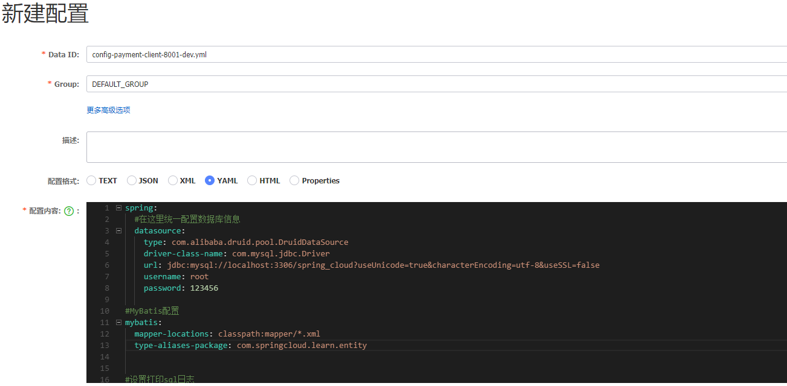

Nacos总配置中心新建配置文件注意事项：

1)  名字严格按照规定${spring.application.name}-${spring.profile.active}.${spring.cloud.nacos.config.file-extension}，注意要加后缀，例： config-payment-client-dev.yml 

2) Data ID就是对应的文件名，namespace, Group都可以自定义添加，满足不同情况下的开发测试需要。

### 7，Nacos配置集群

一，为什么配置集群？

防止单体的Nacos出现停机，影响整个服务

二，配置集群注意事项

1）一般建议在Linux环境下配置Nacos，因为正式环境都在Linux中；

2）Nacos配置集群需要结合nginx，MySQL一起才可；

​      使用nginx负载均衡多个Nacos服务，使用MySQL作为配置信息的持久化存储库。

3）集群数量最少三个。

三，配置集群步骤，以Linux环境为例。

1）下载 Linux版Nacos，放到服务器，并取消使用默认的derby数据库，在Nacos的conf/application.properties里配置链接MySQL数据库，开启数据的持久化，具体设置见本页第5条；

2）配置Nacos 的conf/cluster.conf文件，如果没有则直接复制cluster.confi.example并更名，注意备份。

- 首先执行  hostname  -i  :  查询出localhost对应的ip，但是不能为127.0.0.1，可修改为本机的网卡ens33的ip地址。

修改方法：vi  /etc/hosts : 打开linux的hosts文件

添加以下内容，192.168.30.128 为本机的ip地址：

```txt
192.168.30.128   localhost localhost.localdomain localhost6 localhost6.localdomain6
```

添加完执行hostname -i  : 查看上面的ip是否加入

- 修改Nacos的cluster.conf文件，添加以下内容，把上步设置的ip地址和nacos集群的端口号添加进去

  这里设置的含义是，表明这三个端口号的Nacos是组成的一个集群，实际生产中，不同服务器上的Nacos也可组成集群，每个Nacos里的clust.conf都要写相同的内容，ip地址端口号等要相应变更。

  这里为了练习方便放到一个服务器，仅用端口号区分开。

```properties
192.168.30.128:3001   #三个Nacos集群的端口号
192.168.30.128:3002
192.168.30.128:3003
```

3）修改启动脚本startup.sh，使它启动时可设置不同的端口，注意备份

```shell
while getopts ":m:f:s:c:p:o:" opt  #注意这里新增o:,端口参数一般为p:, 但是这里原来有p:了
do
    case $opt in
        m)
            MODE=$OPTARG;;
        f)
            FUNCTION_MODE=$OPTARG;;
        s)
            SERVER=$OPTARG;;
        c)
            MEMBER_LIST=$OPTARG;;
        p)
            EMBEDDED_STORAGE=$OPTARG;;
        o)					#这两行为新增，对应上面的o:
            PORT=$OPTARG;;    
        ?)
        echo "Unknown parameter"
        exit 1;;
    esac
done
#.....
nohup $JAVA -Dserver.port=${PORT} ${JAVA_OPT} nacos.nacos >> ${BASE_DIR}/logs/start.out 2>&1 &
#-Dserver.port=${PORT}为新增，增加startup.sh启动使得选项 -o
```

配置完成后执行  ./startup.sh  -o  3001启动一个nacos，其它的启动修改端口号即可

**以上配置只能启动一个，原因：根据nacos报错日志显示虚拟机内存不够**

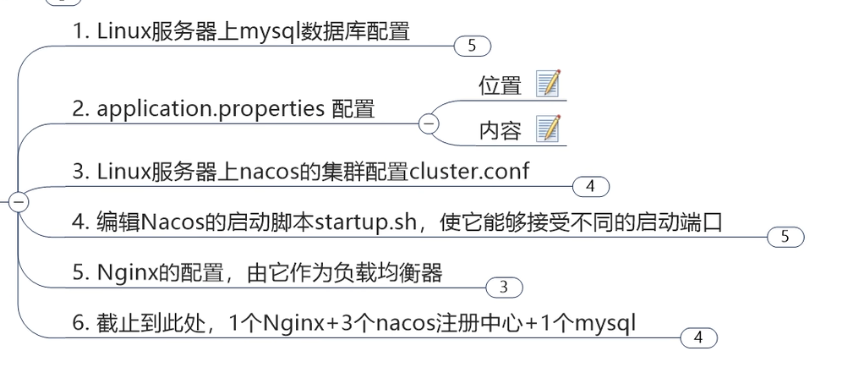

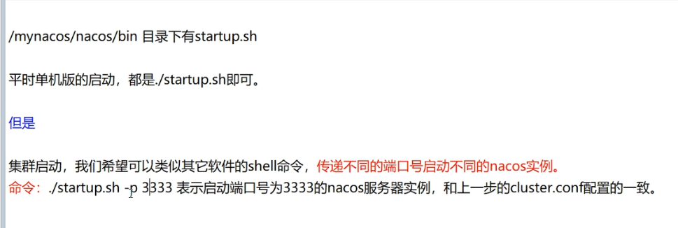

### 8，Sentinel概述

- Sentinel和Hystrix功能相似，但比Hystrix功能强大

Sentinel启动步骤：

1) 直接官网下载jar包运行即可，内嵌Tomcat，账户名密码都是sentinel；

2) Sentinel执行的是懒加载显示机制，服务链接Sentinel以后，登陆Sentinel不会立即展示，访问服务接口后才会在Sentinel监控页面展示；

3) Sentinel是个SpringBoot的前后端不分离项目，分为两部分，后台和前台界面，后台服务是个jar包，使用的是8080端口，和tomcat一样，端口号可修改，参照以下官方文档摘录。

4) 也可下载源码启动项目，Sentinel是一个SpringBoot项目。

**===========官方文档摘录**

Figure 1. Sentinel Dashboard

开启该功能需要3个步骤：

##### 获取控制台

您可以从 [release 页面](https://github.com/alibaba/Sentinel/releases) 下载最新版本的控制台 jar 包。

您也可以从最新版本的源码自行构建 Sentinel 控制台：

- 下载 [控制台](https://github.com/alibaba/Sentinel/tree/master/sentinel-dashboard) 工程(个人注：下载源码，源码是个SpringBoot工程，启动运行，打个jar包也可)
- 使用以下命令将代码打包成一个 fat jar: `mvn clean package`   

##### 启动控制台，可修改端口号

**如若8080端口冲突，可使用 `-Dserver.port=新端口` 进行设置。**

Sentinel 控制台是一个标准的 Spring Boot 应用，以 Spring Boot 的方式运行 jar 包即可。

```shell
java -Dserver.port=6060 -Dcsp.sentinel.dashboard.server=localhost:6060 -Dproject.name=sentinel-dashboard -jar sentinel-dashboard.jar
```

上面的命令行执行后，自动出现一个监控面板，监控本地电脑

只修改端口启动也可以

```shell
java -Dserver.port=6060 -jar sentinel-dashboard.jar
```

##### 配置控制台信息

application.yml

```
spring:
  cloud:
    sentinel:
      transport:
        port: 8719
        dashboard: localhost:8080
```

这里的 `spring.cloud.sentinel.transport.port`  端口配置会在应用对应的机器上启动一个 Http Server，该 Server 会与 Sentinel 控制台做交互。比如 Sentinel  控制台添加了一个限流规则，会把规则数据 push 给这个 Http Server 接收，Http Server 再将规则注册到 Sentinel 中。

更多 Sentinel 控制台的使用及问题参考： [Sentinel 控制台文档](https://github.com/alibaba/Sentinel/wiki/控制台) 以及 [Sentinel FAQ](https://github.com/alibaba/Sentinel/wiki/FAQ)

**==========官方文档摘录结束**

### 9，Sentinel设置流控规则

注意：Sentinel默认只监控Controller层的接口的方法

##### 1，设置QPS，quest  per second

即每秒的请求数，Sentinel可设置对应端口所能接受的每秒请求数

单机阈值表示每秒可接受请求的次数，这里范例设置为一次

如果每秒请求次数超过一次，Sentinel会把请求阻挡住，并在页面报错：Blocked by Sentinel (flow limiting)

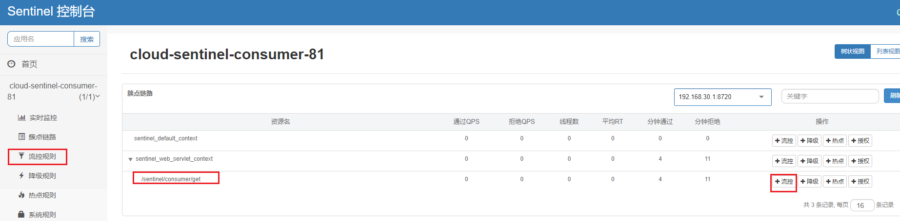

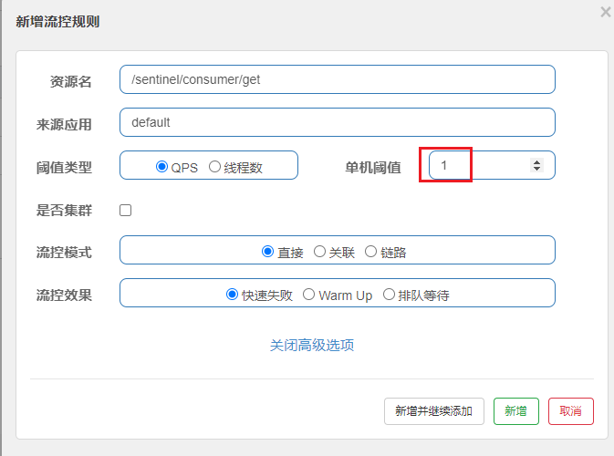

##### 2，线程数直接失败配置

**阈值类型：**线程数。例，下图设置为1，表示设置接口允许访问的线程，如果接口有一个线程访问，则其他线程请求时会报错：Blocked by Sentinel (flow limiting)

**流控模式：**直接，表示直接阻挡。关联，？？？。链路，？？？。

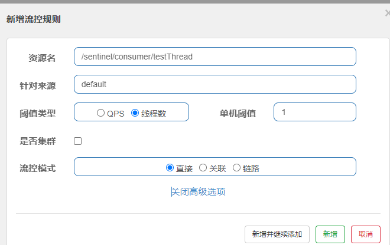

##### 3，流控模式介绍

一，关联

- 流控规则：关联，流控模式：直接(默认)

  指的是接口A访问失败，让其关联的B接口关闭。例，支付接口访问达到最高限制，则让下单接口失败，保证不能支付时，下单功能也不让用，防止连坐。

  图示以阈值类型QPS为例，线程数的关联功能同理。

  测试方法：需在testA接口设置QPS规则，不需在testB接口设置。使用postman模拟密集并发访问testB，因为手动点不过来。当访问testB的接口请求数超过每秒一个时，这是再访问testA就会被Sentinel拦截并报错。
  
  postman并发访问设置见postman笔记。

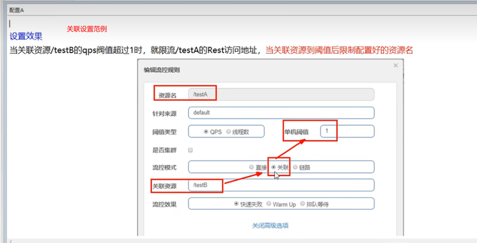

个人设置范例：

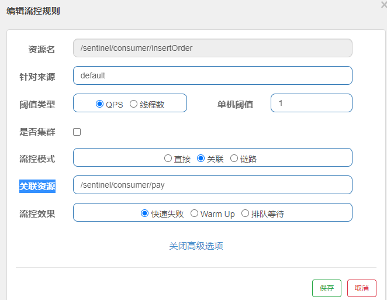

- 流控规则：关联，流控模式：Warm Up

  当一个接口再请求数为0时属于冷却状态，如果突然从这个状态增长到峰值，有可能会直接让服务崩溃，因此由Warm  Up来进行流控，其原理是当请求忽然增多时，逐渐放行请求，过多的请求就阻止，让请求服务接口增加的曲线平缓，从而达到保护服务的目的。**应用场景：商品秒杀**

  二，链路：

  链路规则设置范例：

  Controller层有两个方法同时调用Service层的一个方法，利用链路规则可对Controller层的其中一个方法做限流，当超过一定的QPS时进行阻挡。

  注意：1，因为Sentinel默认只对Controller层做监控，对Service层的方法监控需加@SentinelResource注解，并定义好资源名。

  2，同时需在yml文件设置取消Sentinel的context整合，作用：使得一个controller的接口变成了各自独立的链路

  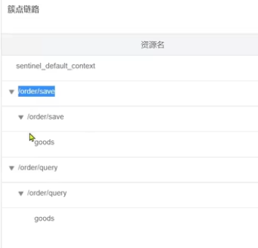

  实际应用：新增订单和查询订单都要查询已有的订单，这是对只查询订单的做限流，保证新增订单功能优先。

  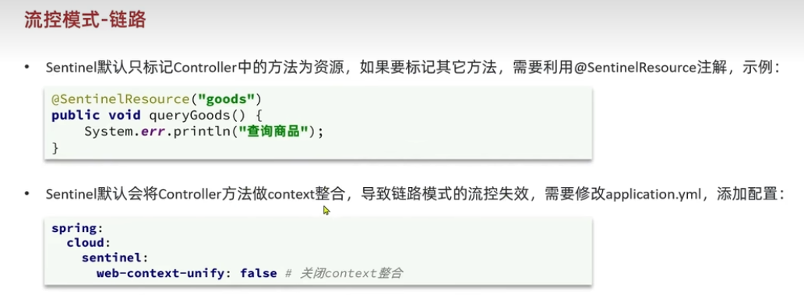

### 10，Sentinel和Hystrix的区别

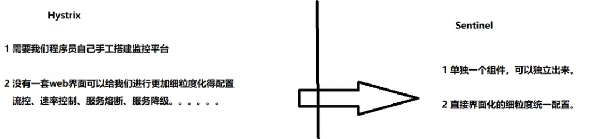

### 11，Sentinel系统自适应限流

系统规则，在所有规则最外层增加的一个总的限流规则，是全局的限流规则；

设置方法：在菜单“系统规则”里设置。

缺点：控制粒度太粗，实际工作中使用不多。