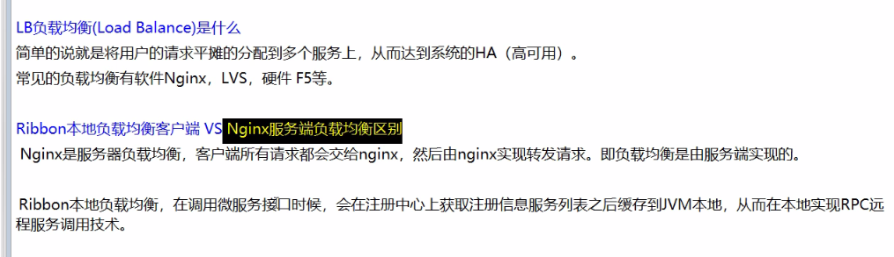
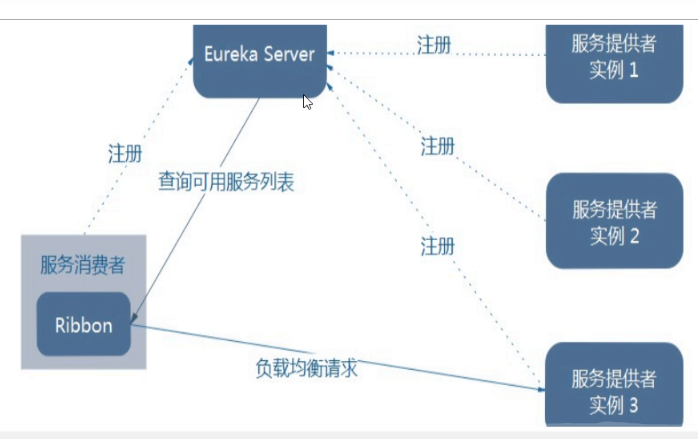
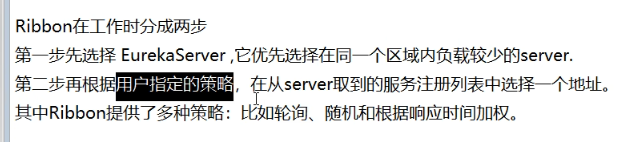
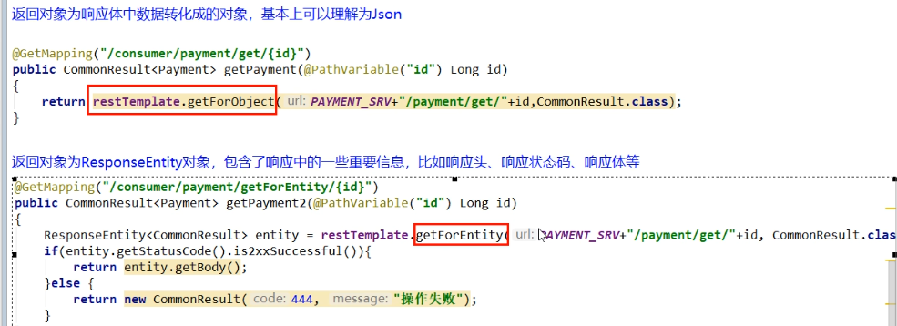
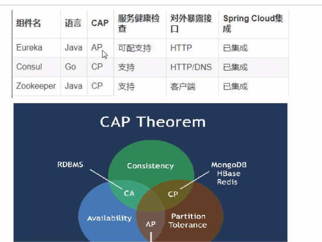
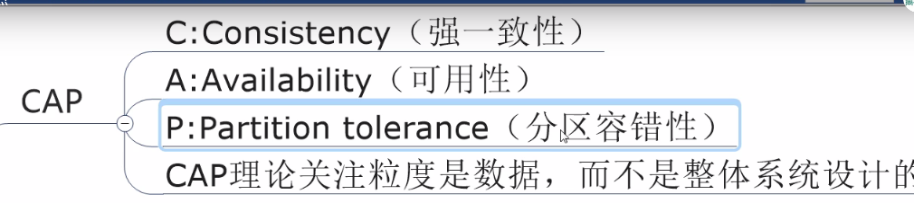

### 1，SpringCloud概念

(1)SpringCloud是什么？

SpringCloud是微服务一套全家桶，提供一个微服务整合方案。其开发是仿造Netflix的一个微服务软件。 SpringBoot是一种微服务技术，相对的，SpringCloud是微服务的一揽子解决方案。

中文文档：https://www.bookstack.cn/read/spring-cloud-docs/docs-index.md

(2)SpringCloud和SpringBoot的版本配合

https://spring.io/projects/spring-cloud 查看官网建议

(3)教程建议版本配置（2020年）


(3)SpringCloud各组件选型

最新技术选择：


旧版，仅需了解


(4)Marin Flower原文

https://www.martinfowler.com/microservices/

```txt
Microservices Guide
In short, the microservice architectural style is an approach to developing a single application as a suite of small services, each running in its own process and communicating with lightweight mechanisms, often an HTTP resource API. These services are built around business capabilities and independently deployable by fully automated deployment machinery. There is a bare minimum of centralized management of these services, which may be written in different programming languages and use different data storage technologies.
-- James Lewis and Martin Fowler (2014)
```

### 2 ，SpringCloud项目构建步骤

约定 > 配置 > 编码

使用Maven构建微服务模块，构建步骤和构建Maven的SpringBoot项目一样

(1)建个父工程：写好pom.xml，包括<dependency-management>等

(2)建模块：右击父工程，新建Maven的Module

(3)写yaml配置文件：规定端口号，项目名称，数据库等信息

(4)写主启动类；

(5)编写业务类的代码。

### 3，使用D开启idea热部署evTools

开发阶段开启热部署，即改动代码不需重启idea，但正式环境不要开启，否则容易出错。

### 4，工程重构

(1)即把各模块重复的代码，提取到一个公用的模块里面，供各模块用，常把实体类，工具类等放到这里

一般都放到commons模块里

(2)然后把commons模块执行 install，安装到本地仓库里，供其它模块调用

### 5，什么是服务注册与发现

Eureka可以有多个，即集群，service provider也可以有多个，根据下面的图理解


### 6，新建模块步骤

约定 > 配置 > 编码

1，建Module;

2，改pom.xml;

3，写yaml;

4，主启动类；

5，编写业务代码。

注意：无论是支付模块，还是消费者模块，都是Client，只有Eureka是Server，在主启动类加注解是注意

### 7，Eureka集群工作原理

互相注册，相互守望


因为Eureka模块的application.yml里：hostname: localhost，所以再多加一个Eureka服务注册模块的话，需要在hosts文件中配置映射，使localhost能映射多个eureka模块。

```yaml
#配置Eureka
eureka:
  instance:
    #hostname: localhost
    hostname: eureka7001.com
```

这样配置实际是让localhost当一个转发器，当访问eureka7001.com:7001端口的时候，访问的是localhost:7001端口，7002同理。

```txt
127.0.0.1  eureka7001.com
127.0.0.1  eureka7002.com
```

### 8，微服务注册后的访问问题

1）微服务模块注册后，例如支付模块注册到Eureka服务注册中心，别的模块调用实际还是直接获取该支付模块的接口并调用，并不是调用Eureka中心，再让Eureka中心调支付模块。别的模块只是从Eureka获取了访问地址。

2）后面加负载均衡之后，消费者模块调用的是Eureka提供的注册服务名，然后由负载均衡的组件进行轮询访问提供相同服务的多个模块，类似于Nginx的负载均衡；

### 9，多个idea同时启动微服务时注意问题

有的端口，注册会互相干扰，应只开一个idea，或关闭其它idea微服务

### 10，搭建Eureka集群，服务模块集群总结

1，服务模块搭建集群之后，消费者模块就不能访问指定模块的地址了，而是访问在Eureka注册中心注册的服务"ann-payment"，这个服务集群是由两个模块组成的ann-payment-8081/8082，它们的在Eureka注册的名字都是一样的“ann-payment”。在消费者模块ben-consumer的restTemplate对象调用http://ann-payment/get/1等接口，即可实现访问这两个服务模块，注意要在consumer模块获取restTemplate对象是加@LoadBalanced注解，才会执行负载均衡访问；

2，Eureka搭建集群的目的是为了防止一个注册中心瘫痪导致整个服务停用的情况；

### 11，使用SpringBoot的actuator来进行Eureka实例的健康检查


点击这些超链接之后，默认会显示空的，跳转地址是：http://desktop-p7ure9c/actuator/info  ，可以更改info为health :http://desktop-p7ure9c/actuator/health  进行健康状况检查，也可以查其它参数，后期待查

### 12，Eureka的自我保护


**Eureka主页提示的含义，是Eureka的自我保护**

1，如果注册到Eureka的某个服务，暂时不可用了，Eureka不会立即删除该服务，而是保留一段时间，因为有可能是网络卡顿，导致该服务模块并没有按时向注册中心发送心跳信息，因此为了保持高可用，Eureka会启动自我保护模式，保留该服务；

2，Eureka的原则是宁可保留有问题的服务，也不会盲目删除它，另一种形式的返乡的宁可错杀一千，不可放过一个；

### 13，Eureka的管理页面设置自定义服务名


  [DESKTOP-P7URE9C:ann-payment:8082](http://desktop-p7ure9c:8082/actuator/info) 是Eureka系统默认的名字

```yaml
eureka:
  client:
  ....
  instance:
    instance-id: ann-payment-8081   #在Eureka管理页面显示此名称，不显示默认的带电脑名字的名称
    prefer-ip-address: true       #设置把鼠标放到服务模块名称上时，显示服务ip地址，不是默认的actuator/..，当然也可以访问
```

(1) prefer-ip-address: false

http://desktop-p7ure9c:8082/actuator/info

(2) prefer-ip-address: true

http://172.16.8.230:8081/actuator/info  :这里显示了ip地址

### 14，Ribbon和nginx负载均衡的区别

**一，区别**

Nginx类似于，你去医院，导诊给你安排到哪个科室去看病。

Ribbon类似于，你到了科室，有人给你安排不同的医生给你看病，



**二，基本架构示意图**





**三，Ribbon基本概念**

- eureka-client依赖已经包含ribbon组件，使用时就不用再引入它的依赖了，否则是画蛇添足。

- Ribbon实际就是负载均衡和RestTemplate结合使用起作用。

- RestTemplate的getForObject()和getForEntity()的区别；

- Ribbon是一个软负载均衡的客户端组件，它可以和其他的客户端一起配合使用，也可以和Eureka结合使用；

  

### 15，三种服务注册中心的区别



